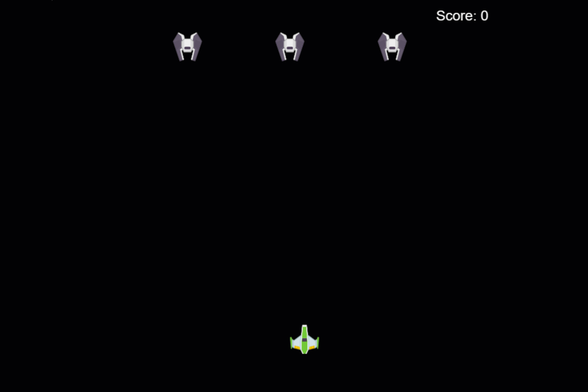

# Green field

Green field is a term used to describe a new project that is being built from scratch. In this section, we will create a new project using GitHub Copilot.

For a green field project to be successful, you need to have a clear understanding of the requirements and the scope of the project.

Code should also be complete in the sense it should be able to run without any errors. Also it should be well documented and tested.

## TASK, create a new project

For this project, we will build a space game. 

### 1 - Create a first scaffold

1. Create an app.js file in a new folder called `space-game`.

Type the following prompt:

> PROMPT: "build a space game that contains a ship you control, should be a green rectangle, and 3 enemy fighters placed at the top of the screen. The screen is 800x600 pixels and uses a canvas element"

You should see a response similar to [index.html](./javascript/index.html) and [app-v1.js](./javascript/app-v1.js)

### 2 - Make the player move

Here we will get the player to move on the screen.

Type the following prompt:

> PROMPT: "make the player move, it should use the keys w a s d to do so"

You should see a response similar to [app-v2.js](./javascript/app-v2.js)

### Add collision detection

Collision detection is an important part of any game. Here we will add collision detection to the game.

Add the following prompt:

> PROMPT: "How can I detect collisions between the player's ship and the enemy fighters in the space game?"

You should see a response similar to [app-v3.js](./javascript/app-v3.js)

### Add behavior on collision

When the player collides with an enemy fighter, we should remove the enemy fighter from the screen and the player should also be removed.

Add the following prompt:

> PROMPT: "destroy player and enemy fighter if they collide"

You should see a response similar to [app-v4.js](./javascript/app-v4.js)

Customize the behavior further by instructing the AI to display game over message and restart the game.

Add the following prompt:

> PROMPT: "if player and enemy collide, display a game over message and reset the game"

You should see a response similar to [app-v5.js](./javascript/app-v5.js)

### Add laser shooting to the player

To make the game more interesting, we will add laser shooting to the player.

When the player presses the space bar, a laser should be created and move upwards.

Add the following prompt:

> PROMPT: "when a player presses space, it should shoot a laser from the top of the ship at high speed, if laser collides with enemy ship then laser and enemy should be destroyed. Laser should also have a cooldown so it can only be fired every 0.5 second"

You should see a response similar to [app-v6.js](./javascript/app-v6.js)

### Add scoring

To make the game even more fun, we will add scoring to the game.

Add the following prompt:

> PROMPT: "show score at the top right of the screen. It should add 50 points every time a laser destroys an enemy"

you should see a response similar to [app-v7.js](./javascript/app-v7.js)

### Add end condition for when all enemies are destroyed

You also want to add an end condition for when all enemies are destroyed.

Add the following prompt:

> PROMPT: "I add end condition, when there are no more enemies, should show, a text that say you won.. if text is clicked then game should reset"

you should see a response similar to [app-v8.js](./javascript/app-v8.js)

### Add proper graphics

To make this game more fun to play, you should add proper graphics instead of just rectangles.

Add the following prompt:

> PROMPT: "from the asset folder load images hero.png, enemy.png and laser.png async and draw those images instead of the rectangles"

## Solution

You will find the solution is [solution.js](./javascript/solution.js)

Run the solution by typing the following command in the terminal:

```bash
npx http-server -p 5000
```

you should see something like so:

